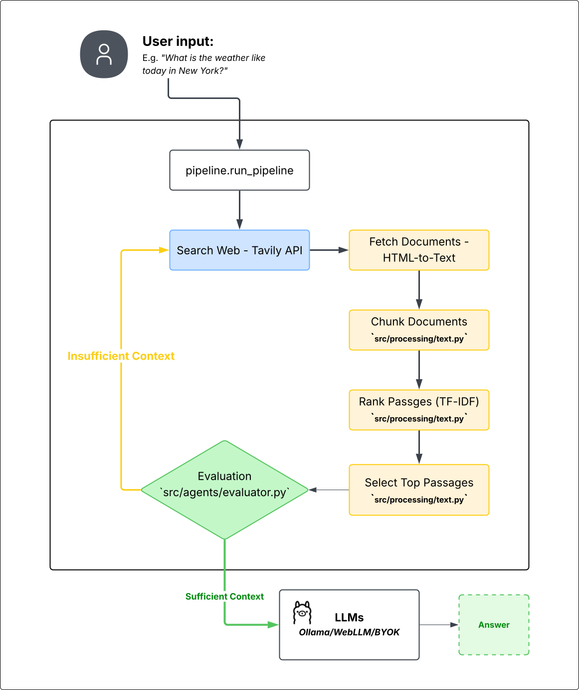

# Project Workflow Visualization

This document explains the iterative web-retrieval RAG-style pipeline implemented in this project.

## 1. Workflow Diagram

The pipeline uses a feedback loop to refine search queries if initial results are insufficient.

## 2. Component Details

| Component | Responsibility | Implementation Logic |
| :--- | :--- | :--- |
| **Search & Fetch** | Finding and downloading content. | Uses the **Tavily API** for search and a custom crawler to convert HTML content into plain text `Document` objects. |
| **Processing** | Breaking down and ranking text. | **Chunking**: Splits docs into 500-word overlapping passages. **Ranking**: Uses `TF-IDF` vectorization and `cosine similarity` to rank passages against the user's question. |
| **Evaluator** | Deciding if we have enough info. | A heuristic engine that checks if there are at least 3 passages from 2 unique domains with a relevance score above 0.22. |
| **Query Refiner** | Improving the search. | If evaluation fails, it generates new queries by appending terms like "official documentation" or keywords extracted from current top passages. |
| **Answerer** | Creating the final output. | A synthesis engine that summarizes the first few sentences of the top-ranked passages and appends citations. |

## 3. Key Characteristics

*   **Iterative Refinement**: The system doesn't just stop at the first search. It analyzes the results and tries different query angles if needed.
*   **Context Budgeting**: Ensures the total context doesn't exceed 8,000 characters or 12 passages.
*   **Deduplication**: Uses SHA-1 fingerprinting to avoid redundant information from multiple sources.
*   **Heuristic-Driven**: Uses efficient classical NLP techniques (TF-IDF, Cosine Similarity) for ranking and evaluation rather than expensive LLM calls for every step.
